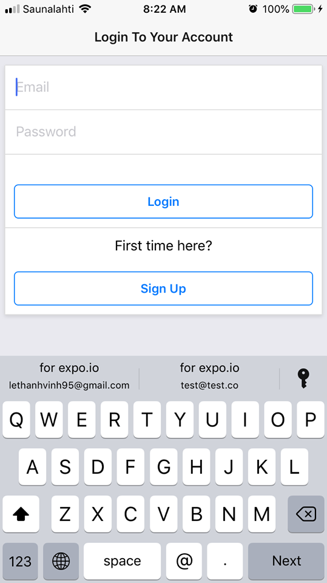

# WeWork
A mobile application allows employees to manage their shifts, view their colleagues' schedules and possibly text them for more information. 
```javascript
  npm install
```
## Features
- [x] Authentication 
- [x] Data saving to Firebase server
- [x] Text functionalities 

## Tech stack
### Environment
* Expo
### Back-end
* Firebase
### Front-end
* React Native, Redux
### Navigation
* React Native Router Flux

## Demo
| Login     | Employee list   | Create new employee     |
| :-------------: | :-------------: | :-------------: |
|  |  |  |

| Updated list    | Edit employee    | Delete employee    | 
| :-------------: | :-------------: | :-------------: |
|  |  |  |
